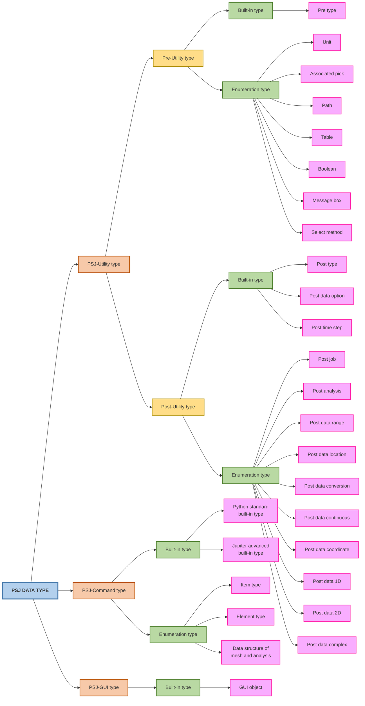

import TreeChart from "@/components/mdx/tree-chart";

<TreeChart chartPath="content/psj-chart.yaml"/>

PSJ has 4 data types:

- Python standard built-in types
- PSJ-Command types
- PSJ-Utility types
- PSJ-GUI types

<TreeChart chartPath="content/psj-chart.yaml"/>

Below session will briefly introduce their structures and usages.

## PSJ-Command type

Data types used by PSJ-Command functions, including:

### Built-in type

There are 2 built-in types:

#### 1. Python Standard built-in type

The principal built-in types are numerics, sequences, mappings, classes, instances and exceptions. For more information,
please visit [Python official document](https://docs.python.org/3/library/stdtypes.html)

#### 2. Jupiter advanced built-in type

Data types used in all PSJ-Commands functions, including: `cursor`, `position`, `vector`, `bool`, `int list`,
`double list`, `string list`, `List of Cursor`, `List of Cursor list`, `position list`, `vector list`, `bool list`,
`cursor pair`, `cursor pair list`, `TSheetd`

You can see the [detailed information here](./data-type/psj-command/built-in-types).

### Enumerations type

This includes enumerations used for:

- [Representing DItem type](./data-type/psj-command/DItem-types)
- [Representing element type](./data-type/psj-command/element-types)
- [Representing data structure of mesh and analysis](./data-type/psj-command/parameter-types/ABAQUS_LBC_STEP_INFO)

## PSJ-Utility type

Data type used by PSJ-Utility functions, including Pre-Utility and Post-Utility:

### Pre-Utility

Data type used for preprocessing workflow, including:

#### Built-in type

Data structure used mainly for storing model database at preprocessing workflow, including: `BodyVector`,
`ConnectVector`, `CoordVector`, `DBody`, `DConnect`, `DCoord`, `DEdge`, `DElem`, `DFace`, `DGroup`, `DItem`,
`DItemPair`, `DItemPairVector`, `DItemVector`, `DLoadBC`, `DSolverJob`, `DNode`, `Document`, `DoubleVector`,
`EdgeVector`, `ElemVector`, `FaceVector`, `GroupVector`, `LoadBCVector`, `SolverJobVector`, `NodeVector`,
`StringVector`, `TVector3d`, `VersionInfo`

You can see the [full list here](./data-type/psj-utility/pre-utility/built-in-types/DBody).

#### Enumerations type

This includes data structure used for:

- [Working with unit](./data-type/psj-utility/pre-utility/enumeration-types/unit-types)
- [Representing associated pick](./data-type/psj-utility/pre-utility/enumeration-types/associate-types)
- [Representing full link to the specified path](./data-type/psj-utility/pre-utility/enumeration-types/path-types)
- [Representing table](./data-type/psj-utility/pre-utility/enumeration-types/dtable-types)
- [Representing boolean](./data-type/psj-utility/pre-utility/enumeration-types/bool-types)
- [Representing message box type](./data-type/psj-utility/pre-utility/enumeration-types/msgbox-types)
- [Representing message box option type](./data-type/psj-utility/pre-utility/enumeration-types/msgbox-option-types)
- [Representing select method](./data-type/psj-utility/pre-utility/enumeration-types/select-method-types)

### Post-Utility

Data type used for postprocessing workflow, including:

#### Built-in type

Data structure used mainly for storing model database at postprocessing workflow, including: `DPostElem`, `DPostNode`,
`Post data option` and `Post time step`.

You can see the [full list here](./data-type/psj-utility/post-utility/post-built-in-types/DPostElem).

#### Enumerations type

This includes data structure used for:

- [Post job type](./data-type/psj-utility/post-utility/enumeration-types/post-job-types)
- [Post analysis type](./data-type/psj-utility/post-utility/enumeration-types/post-analysis-types)
- [Post data range types](./data-type/psj-utility/post-utility/enumeration-types/post-data-range-types)
- [Post data location type](./data-type/psj-utility/post-utility/enumeration-types/post-result-data-loc-types)
- [Post data conversion type](./data-type/psj-utility/post-utility/enumeration-types/post-result-data-cnv-types)
- [Post data continuous type](./data-type/psj-utility/post-utility/enumeration-types/post-result-data-cont-types)
- [Post data coordinate](./data-type/psj-utility/post-utility/enumeration-types/post-result-data-coord-types)
- [Post data 1D type](./data-type/psj-utility/post-utility/enumeration-types/post-result-data-load1d-types)
- [Post data 2D type](./data-type/psj-utility/post-utility/enumeration-types/post-result-data-load2d-types)
- [Post data complex type](./data-type/psj-utility/post-utility/enumeration-types/post-result-data-complex-types)

## PSJ-GUI type

Data types used by PSJ-GUI functions, including:

### Built-in type

Data structure used mainly for working with Jupiter GUI, including: `TableCellID`, `TableCellVector`, `TableCellRange`,
`TableCellRangeVector`, `TableColumnInfo`, `TableColumnInfoVector`, `PSJFont`, `PSJMessageBox`.

You can see the [full list here](./data-type/psj-gui/TableCellID).

### Enumerations type

This includes data structure used for `PSJMessageBox`:

- [MessageBox Icon Types](./data-type/psj-gui/psj-message-box/msgbox-icon-types)
- [MessageBox Button Types](./data-type/psj-gui/psj-message-box/msgbox-button-types)
- [MessageBox Position Types](./data-type/psj-gui/psj-message-box/msgbox-position-types)
