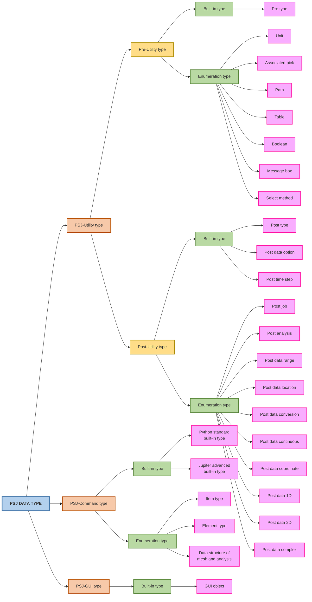

import {
    Building2Icon,
    Code2Icon,
    CodeIcon,
    CpuIcon,
    DraftingCompassIcon,
    GraduationCapIcon,
    RepeatIcon,
    ShieldCheckIcon,
    SlidersHorizontalIcon,
    SparklesIcon,
    WorkflowIcon,
    ZapIcon,
} from 'lucide-react';

## Why PSJ exists

CAE workflows have a natural tension: the software is powerful, but repetitive work is slow, error-prone, and hard to
standardise across teams. PSJ was built to close that gap.

<Cards>

<Card icon={<RepeatIcon className="text-purple-300" />} title="Repetition kills productivity">
    Manual operations that run dozens of times daily can't be completed within target durations — automation is the only
    path forward.
</Card>

<Card icon={<ShieldCheckIcon className="text-blue-300" />} title="Human error is avoidable">
    Complex multi-step procedures drift over time. A scripted workflow runs identically every run, eliminating rework
    cost entirely.
</Card>

<Card icon={<GraduationCapIcon className="text-green-300" />} title="High CAE training cost">
    Sophisticated modelling demands deep knowledge. A guided PSJ dialog abstracts complexity for occasional users
    without sacrificing capability.
</Card>

<Card icon={<SlidersHorizontalIcon className="text-orange-300" />} title="Every team works differently">
    Design rules, naming conventions, and approval processes vary. PSJ lets organisations embed their own logic directly
    into Jupiter's ribbon.
</Card>

</Cards>

## The four pillars of PSJ

PSJ is not a single tool — it's a layered system of six interconnected components. Knowing when to reach for each one is
the key to writing efficient, maintainable automation.

<Cards>

<Card icon={<SparklesIcon className="text-purple-300" />} title="Friendly">
    GUI Command Builder and a built-in IDE mean you don't need Python to create dialogs. Drag-and-drop composition, live
    previews, and full autocomplete lower the barrier to near zero.
</Card>

<Card icon={<ZapIcon className="text-blue-300" />} title="Fast">
    Operations requiring 30 minutes of manual work run in seconds once scripted — triggerable from a single ribbon
    button with no additional clicks.
</Card>

<Card icon={<Code2Icon className="text-green-300" />} title="Functional">
    A purpose-built IDE with highlighting, autocomplete and tooltips provides a professional environment inside Jupiter.
    The Shell gives an interactive REPL with one-click error navigation.
</Card>

<Card icon={<WorkflowIcon className="text-orange-300" />} title="Flexible">
    Fully compatible with Python 3.x and its ecosystem. NumPy, pandas, matplotlib, scikit-learn bundled. Excel,
    PowerPoint, OpenFOAM, custom solvers — all first-class targets.
</Card>

</Cards>

## Who is PSJ for?

<Cards>

<Card icon={<DraftingCompassIcon className="text-purple-300" />} title="CAD Designers">
    Run design-rule checks and repeated analysis sequences via ribbon buttons. No scripting experience required.
</Card>

<Card icon={<CpuIcon className="text-blue-300" />} title="CAE Engineers">
    Automate mesh generation, load application, and result extraction. Cut modelling time from hours to minutes.
</Card>

<Card icon={<CodeIcon className="text-green-300" />} title="CAE Experts (Python)">
    Interface with external solvers, databases, or cloud services. Build advanced pipelines with the full Python
    data-science stack.
</Card>

<Card icon={<Building2Icon className="text-orange-300" />} title="CAE Organisations">
    Deploy a maintainable in-house CAD-CAE automation system built on your own workflow templates and wizard dialogs.
</Card>

</Cards>
