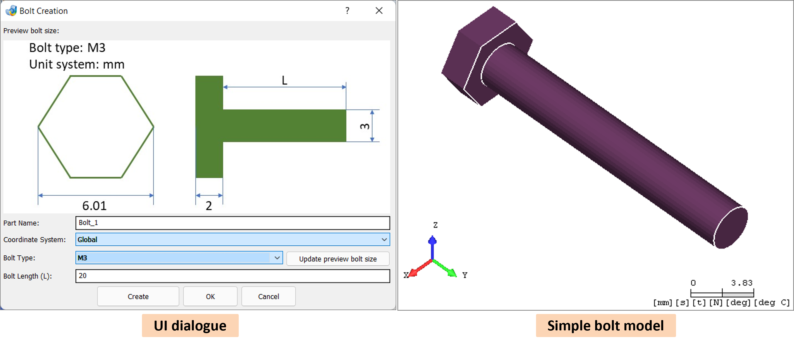
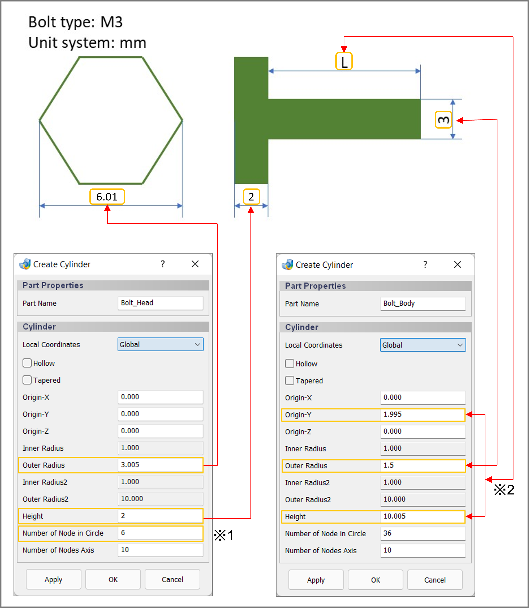
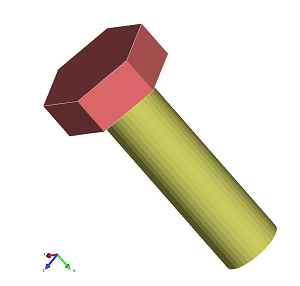
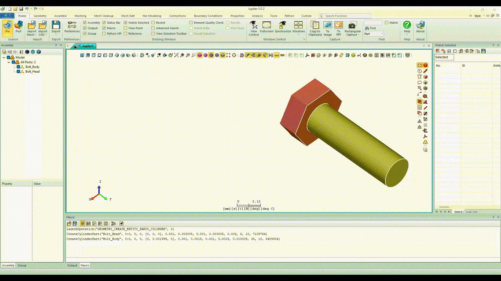
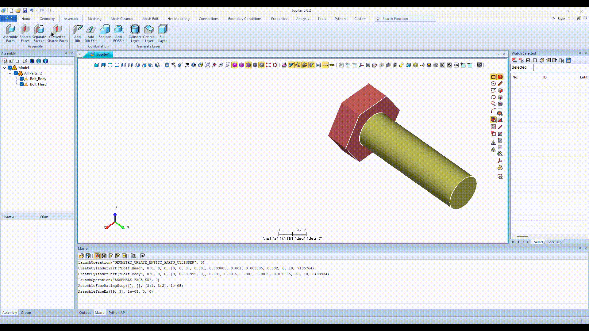
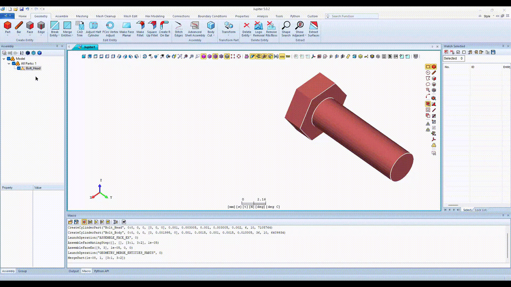
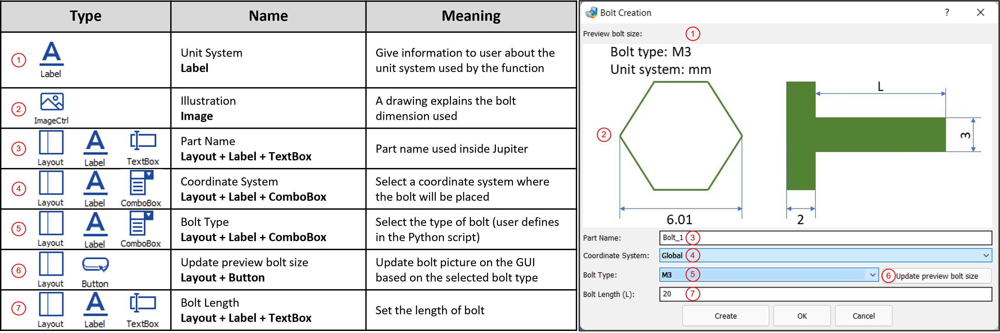
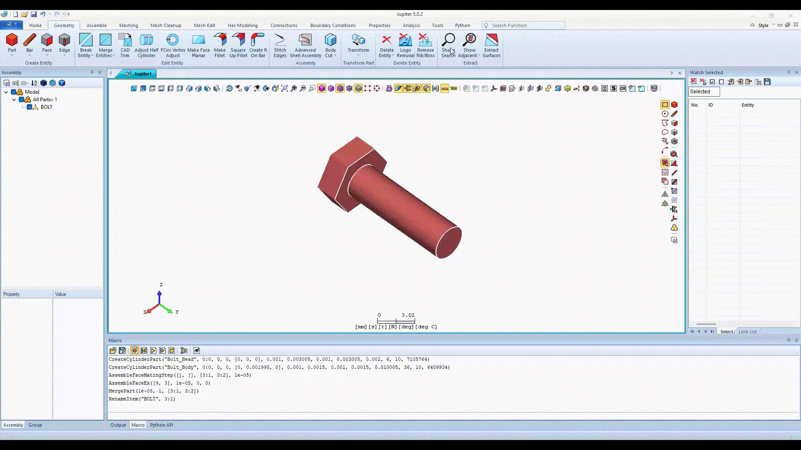
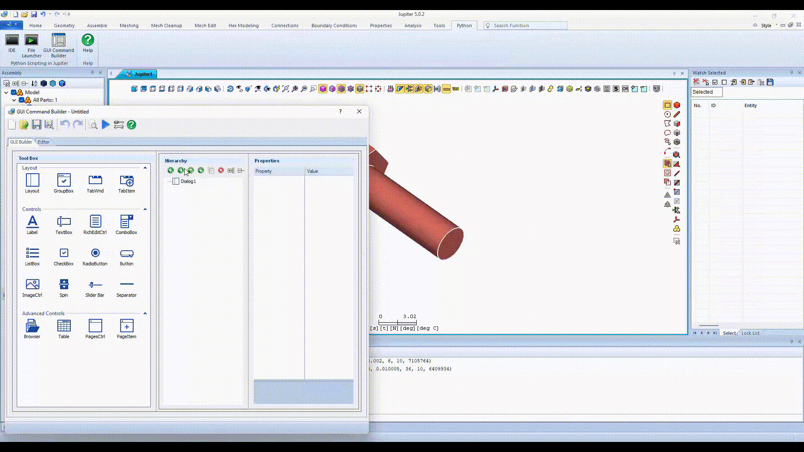
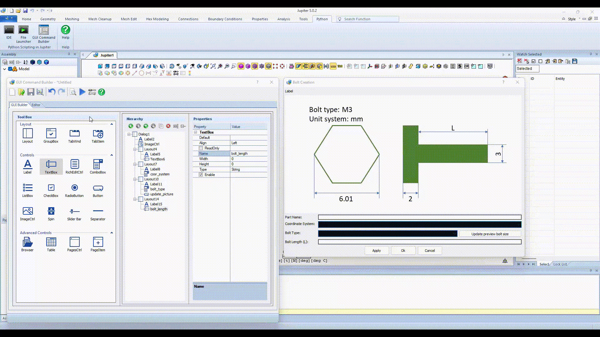

This tutorial demonstrates how to make a custom bolt by using a pre-defined template of PSJ-Command/Jupiter's Macro. It
will also integrate the PSJ-Command/Jupiter's Macro to a customized UI dialog by using GUI Command Builder.

<Callout type="info" title="In this tutorial, you’ll learn">
    1. How to get and make use of the PSJ-Command/Jupiter's Macro. 2. Implement the PSJ-Command/Jupiter's Macro to a
    general Python script for the automation process. 3. Creat a dialog by using GUI Command Builder. 4. Integrate the
    user script in (2.) to the created dialog in (3.) to make a custom UI function. 5. Add the created custom UI
    function in (4.) to Jupiter's ribbon and use it.
</Callout>
## 0. Overview

**About this dialog**: you will make an UI dialog to integrate the customized PSJ-Command/Jupiter's Macro for the
automation process.

After selecting the bolt's size and pressing Apply or OK button (_left picture_), a user-standard bolt will be created
and shown in Jupiter's screen (_right picture_).



**In general, below are the steps that you will follow:**

1. **Get PSJ-Command or Macro**: Execute the available functions in Jupiter to get the respective PSJ-Command or Macro.
2. **Create DEF function in Python**: Combine PSJ-Command or Macro with Python based script in order to create an
   user-defined function fully.
3. **Create User Interface (UI)**: Use GUI Command Builder to make an UI dialog connecting to the user-defined function
   in (2.).
4. **Implement**: Register the created UI dialog in (3.) to Jupiter.

---

## 1. Get PSJ-Command/Macro

In this section, you can learn how to get the PSJ-Command/Macro from the executed function.

Within this example, you also can know how to implement the PSJ-Command/Macro of the following functions:

- <menuselection>Geometry &#187; Create Entity &#187; Part &#187; Cylinder</menuselection> function.
- <menuselection>Assemble &#187; Assemble &#187; Assemble Faces</menuselection> function.
- <menuselection>Geometry &#187; Edit Entity &#187; Merge Entities &#187; Parts</menuselection>
  function.
- Rename the part on the <kbd>Assembly window</kbd>.

### 1.1. Create 2 cylinders

Use <menuselection>Geometry &#187; Create Entity &#187; Part &#187; Cylinder</menuselection> function to make 2
cylinders in sequence: one for bolt head, the other for bolt body.



> ※1. The number of the edge of the bolt head. In this case, we inputted 6 for 6 edges of the bolt head. You can change
> it by your own.
>
> ※2. Value of L parameter will be equal to (Height - Origin-Y), and Origin-Y will be equal to the height of bolt head -
> 0.005. The reason is to prevent zero-touch case.

Then, you can see the created bolt on the Jupiter's display window:



A corresponded PSJ-Command in the Python API window and Macro in the Macro window will be generated as below:

<Tabs
  groupId="commands-macros"
  defaultIndex={0}
  values={['psj', 'macro']}
>
<Tab value="psj">

```psj
Geometry.Part.Cylinder(strName="Bolt_Head", dTopOuterRadius=0.003005,
    dBottomOuterRadius=0.003005, dHeight=0.002, iCircularNodes=6)
Geometry.Part.Cylinder(strName="Bolt_Body", dlOrigin=[0.0, 0.001995, 0.0],
    dTopOuterRadius=0.0015, dBottomOuterRadius=0.0015, dHeight=0.010005, iPartColor=6409934)
```

</Tab>
<Tab value="macro">

```psj
CreateCylinderPart("Bolt_Head", 0:0, 0, 0, [0, 0, 0], 0.001, 0.003005, 0.001, 0.003005, 0.002, 6, 10, 7105764)
CreateCylinderPart("Bolt_Body", 0:0, 0, 0, [0, 0.001995, 0], 0.001, 0.0015, 0.001, 0.0015, 0.010005, 36, 10, 6409934)
```

</Tab>
</Tabs>

### 1.2. Create assemble faces

Then, use <menuselection>Assemble &#187; Assemble &#187; Assemble Faces</menuselection> function to generate share faces
between the created 2 cylinders:

1. Input tolerance = 0.01 to the Tolerance textbox.
2. Click on the Find button to find all the faces between the created 2 cylinders.
3. Click on the Apply or OK button to generate share faces finding from (2.).



A corresponded PSJ-Command in the Python API window and Macro in the Macro window will be generated as below:

<Tabs
  groupId="commands-macros"
  defaultIndex={0}
  values={['psj', 'macro']}
>
<Tab value="psj">

```psj
Assemble.FindMatingFaceEx(crlTaBodies=[Part(1, 2)], dMatingTol=1e-05)
Assemble.AssembleFaceEx(ilPairFaceToMakeShareFace=[9, 3], dTolerance=1e-05, iTypeConnectPos=0)
```

</Tab>
<Tab value="macro">

```psj
AssembleFaceMatingStep([], [], [3:1, 3:2], 1e-05)
AssembleFaceEx([9, 3], 1e-05, 0, 0)
```

</Tab>
</Tabs>

### 1.3. Merge 2 parts

Next, use <menuselection>Geometry &#187; Edit Entity &#187; Merge Entities &#187; Parts</menuselection> function to
merge 2 cylinders into 1 part. This part will be considered as a simple bolt geometry using in this tutorial:

1. Select 2 created cylinders with their shared faces.
2. Click on the Apply or OK button to merge them into 1 part.



A corresponded PSJ-Command in the Python API window and Macro in the Macro window will be generated as below:

<Tabs
  groupId="commands-macros"
  defaultIndex={0}
  values={['psj', 'macro']}
>
<Tab value="py">

```psj
Geometry.MergeEntities.Parts(crlParts=[Part(1, 2)], dMergeTolerance=1e-05)
```

</Tab>
<Tab value="python">

```psj
MergePart(1e-08, 1, [3:1, 3:2])
```

</Tab>
</Tabs>

### 1.4. Rename the part

Finally, right-click on the merged part in the Assembly window to rename this part to **BOLT**.



A corresponded PSJ-Command in the Python API window and Macro in the Macro window will be generated as below:

<Tabs
  groupId="commands-macros"
  defaultIndex={0}
  values={['psj', 'macro']}
>
<Tab value="psj">

```psj
Assembly.RightClick.Rename(strNewName="BOLT", crItem=Part(1))
```

</Tab>
<Tab value="macro">

```psj
RenameItem("BOLT", 3:1)
```

</Tab>
</Tabs>

---

## 2. Create DEF function in Python

To recap, below is the total PSJ-Command and Macro collected in the above steps:

<Tabs
  groupId="commands-macros"
  defaultIndex={0}
  values={['psj', 'macro']}
>
<Tab value="psj">

```psj
Geometry.Part.Cylinder(strName="Bolt_Head", dTopOuterRadius=0.003005,
    dBottomOuterRadius=0.003005, dHeight=0.002, iCircularNodes=6)
Geometry.Part.Cylinder(strName="Bolt_Body", dlOrigin=[0.0, 0.001995, 0.0],
    dTopOuterRadius=0.0015, dBottomOuterRadius=0.0015, dHeight=0.010005, iPartColor=6409934)
Assemble.FindMatingFaceEx(crlTaBodies=[Part(1, 2)], dMatingTol=1e-05)
Assemble.AssembleFaceEx(ilPairFaceToMakeShareFace=[9, 3], dTolerance=1e-05, iTypeConnectPos=0)
Geometry.MergeEntities.Parts(crlParts=[Part(1, 2)], dMergeTolerance=1e-05)
Assembly.RightClick.Rename(strNewName="BOLT", crItem=Part(1))
```

</Tab>
<Tab value="macro">

```psj
CreateCylinderPart("Bolt_Head", 0:0, 0, 0, [0, 0, 0], 0.001, 0.003005, 0.001, 0.003005, 0.002, 6, 10, 7105764)
CreateCylinderPart("Bolt_Body", 0:0, 0, 0, [0, 0.001995, 0], 0.001, 0.0015, 0.001, 0.0015, 0.010005, 36, 10, 6409934)
AssembleFaceMatingStep([], [], [3:1, 3:2], 1e-05)
AssembleFaceEx([9, 3], 1e-05, 0, 0)
MergePart(1e-08, 1, [3:1, 3:2])
RenameItem("BOLT", 3:1)
```

</Tab>
</Tabs>

Use the above scripts, now parameterize the numbers and add some built-in Python functions (if…else, for, while, etc.)
to make the script adapt to different input parameters.

<Callout type="info" title="To execute the code in Python, use 2 ways as below:">
    1. PSJ-Command: Copy and paste directly to the creating Python code. 2. Macro: use the following structure to
    execute the code in python`JPT.Exec(“Macro”)`.
</Callout>
<Callout type="info">
    The PSJ-Command and/or Macro is added to create the bolt according to the value generated by user. From now, user
    can combine the knowledge about Python language and the just generated Macro to create def function.
</Callout>
The following process will show you the way to prepare important **def** of this example:

### 2.1. Step 1: Import the important libraries

```psj
import re
from os import listdir
from os.path import isfile, join
from pyjdg import *
import random
```

In which:

1. **re** is a library helping you to modify string.
2. **listdir**, **isfile**, **join** are the libraries helping you to get all files inside a specific folder.
3. **pyjdg** is a library to enable GUI Command Builder.
4. **random** is a library to get a random number (for setting part's color).

### 2.2 Step 2: Prepare standard bolt sizes

The output structure of the parameters of bolt size will follow the following structure: [Bolt head's height, Bolt
head's diameter, Bolt body's diameter].

```psj
def get_bolt_size(get_param_bolt_type):
    ''' Bolt type for standard size'''
    if get_param_bolt_type == 0: # M3
        return [2e-3, 6.01e-3, 3e-3]
    elif get_param_bolt_type == 1: # M4
        return [2.8e-3, 7.66e-3, 4e-3]
    elif get_param_bolt_type == 2: # M5
        return [3.5e-3, 8.79e-3, 5e-3]
    elif get_param_bolt_type == 3: # M6
        return [4e-3, 11.5e-3, 6e-3]
    elif get_param_bolt_type == 4: # M8
        return [5.3e-3, 14.38e-3, 8e-3]
    elif get_param_bolt_type == 5: # M10
        return [6.4e-3, 18.9e-3, 10e-3]
    elif get_param_bolt_type == 6: # M12
        return [7.5e-3, 21.1e-3, 12e-3]
    elif get_param_bolt_type == 7: # M14
        return [8.8e-3, 24.49e-3, 14e-3]
    elif get_param_bolt_type == 8: # M16
        return [10e-3, 26.75e-3, 16e-3]
    elif get_param_bolt_type == 9: # M18
        return [11.5e-3, 30.14e-3, 18e-3]
    elif get_param_bolt_type == 10: # M20
        return [12.5e-3, 33.53e-3, 20e-3]
    elif get_param_bolt_type == 11: # M22
        return [14e-3, 35.72e-3, 22e-3]
    elif get_param_bolt_type == 12: # M24
        return [15e-3, 39.98e-3, 24e-3]
    elif get_param_bolt_type == 13: # M27
        return [17e-3, 45.2e-3, 27e-3]
    elif get_param_bolt_type == 14: # M30
        return [18.7e-3, 50.85e-3, 30e-3]
    else:
        print("error")
```

<Callout type="info">
    The given values are the reference values. You can change those values based on your standard.
</Callout>
### 2.3. Step 3: Prepare def function for changing preview

Create the below **def** function for executing whenever changing the bolt type (Update preview pictures).

```psj
def change_bolt_pic(dlg):
    ''' Change the picture of the select bolt '''
    picture_folder = re.sub(re.escape("\\"), "/", (JPT.GetAppPathInfo(JPT.PathType.PROGRAM_PATH) +
                                                    r'SampleData\PSJ\PSJ-GUI\CreateBolt\CreatingBolt_Pics'))
    only_file = [f for f in listdir(picture_folder) if isfile(join(picture_folder, f))]
    for i in only_file:
        file_name, file_extension = i.split('.')
        if dlg.get_item_text('bolt_type') == file_name:
            full_path = picture_folder + "/" + i
            dlg.set_image_file('ImageCtrl', full_path)
```

In which:

**picture_folder** is a parameter to get full path to the stored preview pictures.

> We stored all the related files relating to this tutorial in the Jupiter installation folder.
>
> **picture_folder** is the parameter refering to the stored location to get stored pictures. The stored localtion:
>
> <menuselection>Jupiter installation folder &#187; SampleData &#187; PSJ &#187; PSJ-GUI &#187; CreateBolt &#187; CreatingBolt_Pics</menuselection>

### 2.4. Step 4: Prepare a function to modify the output value of Assemble Faces function

With the current output value of the Assemble Faces function, we need to modify before using it.

The current output of the finding pair faces option will have the following structure (For example): _1, ["72-47"]_.

Or, you can understand via the following structure: _1, ["face1-face2","face3-face4","face5-face6",...]_

So, to make it can be used, you can use the following **def** function (or you can create your own function).

<Callout type="info">
    Whenever start using a function, you should check it's output values and type. In Jupiter, we're supporting a
    utility called [JPT.Debugger](/docs/psj-utility/JPT.Debugger)
</Callout>
```psj def replace_str(err, in_str): mod_str = in_str for i in range (len(err)): mod_str = mod_str.replace(str(err[i]),
" ")

    mod_str = re.sub("s+", " ", mod_str).strip().split(" ")
    return mod_str

````

### 2.5. Step 5: Prepare the execution function

Based on the created PSJ-Command and Jupiter's Macro from the previous steps, the **on_execute_button_clicked()** function is responsible for implementing the Apply or OK button. It will have the following structure:

<Tabs
  groupId="commands-macros"
  defaultValue="psj"
  values={[
    { label: 'PSJ-Command', value: 'psj', },
    { label: 'Macro', value: 'macro', },
  ]
}>
<Tab value="psj">

```psj showLineNumbers
def on_execute_button_clicked(dlg):
    '''
    Create a bolt when click on the Apply or OK button.
        Parameters:
            dlg: Call class dlg for using [dlg.] - API between the GUI Command Builder and Python.
        Results:
            A bolt is created when Apply or OK button is clicked.
    '''
    # Preparing parameters for the creation
    part_name = dlg.get_item_text(name="part_name")
    coord_system = int(dlg.get_combobox_sel(name="coord_system"))
    bolt_type = int(dlg.get_combobox_sel(name="bolt_type"))
    [k, e, d] = get_bolt_size(bolt_type) # Get size of the creating bolt based on the selected bolt_type option
    nut_radius = e/2
    thread_radius = d/2
    cylinder_height = k
    cylinder_position = cylinder_height
    bolt_length = dlg.get_item_text(name="bolt_length")
    get_param_bolt_length = float(bolt_length)*0.001
    color = random.randint(10000, 60000000)

    # Creating bolt head and bolt body
    Geometry.Part.Cylinder(strName=part_name,
                            dlOrigin=[0, 0, 0],
                            dTopOuterRadius=nut_radius,
                            dBottomOuterRadius=nut_radius,
                            dHeight=cylinder_height,
                            iCircularNodes=6,
                            iPartColor=color)
    Geometry.Part.Cylinder(strName=part_name,
                            dlOrigin=[0, cylinder_position, 0],
                            dTopOuterRadius=thread_radius,
                            dBottomOuterRadius=thread_radius,
                            dHeight=get_param_bolt_length,
                            iPartColor=color,
                            crLocalCoordinate=Coord(coord_system))

    # Making assemble faces
    all_part = sorted([a.id for a in JPT.GetAllParts()], reverse = False)
    assemble_face_func = JPT.Exec('AssembleFaceMatingStep([], [], [3:{0}, 3:{1}], 0.0003).'
                                  .format(all_part[-2], all_part[-1]))
    errstr = ", []-\""
    JPT.Exec('AssembleFaceEx([{0}, {1}], 0.0003, 0, 0)'
             .format(replace_str(errstr, assemble_face_func)[-2], replace_str(errstr, assemble_face_func)[-1]))

    # Merging 2 created parts into 1 part
    JPT.Exec('MergePart(1e-05, 1, [3:{0}, 3:{1}])'.format(all_part[-2], all_part[-1]))

    # Show the created part
    JPT.Exec('View Fit To Model()')

    # Change the part_name parameter (On the GUI) automatically
    if str(dlg.get_item_text(name="part_name")).find("_") != -1:
        if dlg.get_item_text(name="part_name").split("_")[-1].isdigit() == True:
            new_name = dlg.get_item_text(name="part_name")[:-(len(dlg.get_item_text(name="part_name")
            .split("_")[-1]) + 1)] + "_" + str(int(dlg.get_item_text(name="part_name").split("_")[-1]) + 1)
        else:
            new_name = dlg.get_item_text(name="part_name") + "_" + str(len([_.id for _ in JPT.GetAllParts()]) + 1)
    else:
        new_name = dlg.get_item_text(name="part_name") + "_" + str(len([_.id for _ in JPT.GetAllParts()]) + 1)

    dlg.set_item_text(name="part_name", text=new_name)
````

</Tab>
<Tab value="macro">

```psj showLineNumbers
def on_execute_button_clicked(dlg):
    '''
    Creating a bolt when click on the Apply or OK button
        Parameters:
            dlg: Call class dlg for using [dlg.] - API between the GUI Command Builder and Python.
        Results:
            A bolt is created when Apply or OK button is clicked.
    '''
    # Preparing parameters for the creation
    part_name = dlg.get_item_text(name="part_name")
    coord_system = int(dlg.get_combobox_sel(name="coord_system"))
    bolt_type = int(dlg.get_combobox_sel(name="bolt_type"))
    [k, e, d] = get_bolt_size(bolt_type) # Get size of the creating bolt based on the selected bolt_type option
    nut_radius = e/2
    thread_radius = d/2
    cylinder_height = k
    cylinder_position = cylinder_height
    bolt_length = dlg.get_item_text(name="bolt_length")
    get_param_bolt_length = float(bolt_length)*0.001
    color = random.randint(10000, 60000000)

    # Creating bolt head and bolt body
    JPT.Exec('CreateCylinderPart("{0}", 27:{1}, 0, 0, [0, 0, 0], 0.001, {2}, 0.001, {2}, {3}, 6, 10, {4})'
             .format(part_name, coord_system, nut_radius, cylinder_height, color))
    JPT.Exec('CreateCylinderPart("{0}", 27:{1}, 0, 0, [0, {2}, 0], 0.001, {3}, 0.001, {3}, {4}, 36, 10, {5})'
             .format(part_name, coord_system, cylinder_position, thread_radius, get_param_bolt_length, color))

    # Making assemble faces
    errstr = ", []-\""
    all_part = sorted([a.id for a in JPT.GetAllParts()], reverse = False)
    assemble_faces = JPT.Exec('AssembleFaceMatingStep([], [], [3:{0}, 3:{1}], 0.0003).'
                              .format(all_part[-2], all_part[-1]))
    JPT.Exec('AssembleFaceEx([{0}, {1}], 0.0003, 0, 0)'
             .format(replace_str(errstr, assemble_faces)[-2],
                                 replace_str(errstr, assemble_faces)[-1]))

    # Merging 2 created parts into 1 part
    JPT.Exec('MergePart(1e-08, 1, [3:{0}, 3:{1}])'.format(all_part[-2], all_part[-1]))

    # Show the created part only
    JPT.InverseHideBodies(all_part[-2])
    JPT.ViewFitToModel()

    # Change the part_name parameter (On the GUI) automatically
    if str(dlg.get_item_text(name="part_name")).find("_") != -1:
        if dlg.get_item_text(name="part_name").split("_")[-1].isdigit() == True:
            new_name = dlg.get_item_text(name="part_name")[:-(len(dlg.get_item_text(name="part_name")
            .split("_")[-1]) + 1)] + "_" + str(int(dlg.get_item_text(name="part_name").split("_")[-1]) + 1)
        else:
            new_name = dlg.get_item_text(name="part_name") + "_" + str(len([_.id for _ in JPT.GetAllParts()]) + 1)
    else:
        new_name = dlg.get_item_text(name="part_name") + "_" + str(len([_.id for _ in JPT.GetAllParts()]) + 1)
    dlg.set_item_text(name="part_name", text=new_name)
```

</Tab>
</Tabs>

---

## 3. Create User Interface (UI)

**Before creating UI for this sample:** The target user interface (_Right picture_) requiring all the components of the
GUI Command Builder (_Left picture_).



### 3.1. Open GUI Command Builder

Ribbon: <menuselection>Python &#187; Python Scripting in Jupiter &#187; GUI Command Builder</menuselection>



### 3.2. Create a dialog with title and execution buttons

To create a dialog with title and execution buttons, please do the following steps:

1. In the opened dialog, click on the Dialog component inside the Hierarchy window.
2. After clicking on the Dialog component (1.), change its properties as the below suggestions:
    <br />
    2.1. <b>Title</b>: <i>Bolt Creation</i>.
    <br />
    2.2. <b>Validation</b>: Checked on (Enable this option).
    <br />
    2.3. <b>Apply Button</b>: Checked on (Enable this option).
    <br />
    2.4. <b>Ok Button</b>: Checked on (Enable this option).
    <br />
    2.5. <b>Cancel Button</b>: Checked on (Enable this option).



### 3.3. Add components

To add the required components to the creating dialog, please follow the following steps:

1. Add _Unit System: mm_ by using **Label** component.
2. Add _an image_ as a preview picture into the creating dialog by using **ImageCtrl** component.
3. Add _Part Name_ textbox to input the name of the creating bolt by using **Layout**, **Label** and **TextBox**
   components.
4. Add _Coordinate System_ selection to select the reference coordinate system for creating bolt by using **Layout**,
   **Label** and **ComboBox** components.
5. Add _Bolt Type_ selection to select the reference coordinate system for creating bolt by using **Layout**, **Label**
   and **ComboBox** components.
6. Add _Update preview bolt size_ button to update the preview bolt picture on the GUI based on the selected bolt type
   by using **Layout** and **Button** components.
7. Add _Bolt Length_ textbox to input the length of the creating bolt by using **Layout**, **Label** and **TextBox**
   components.


### 3.4. Export the created UI to python file

After creating your own UI, you need to export it to Python file (**\*.py**):

1. Click on the **Show or hide code window(F1)** button to show/hide the UI code (Python format).
2. Click on the <kbd>Export PSJ</kbd> button to export the created UI to Python file (**\*.py**).



### 3.5. Bind the created def functions from [2.](#2-create-def-function-in-python) to the created UI from [3.4](#34-export-the-created-ui-to-python-file)

After exporting the created UI to Python file (**\*.py**), you need to bind the created def functions to the created UI.

The created **def** functions in [2.](#2-create-def-function-in-python) and their corresponding are shown as below:

<table border="1">
    <tr>
        <th rowspan="2">Created def function </th>
        <th colspan="2">Corresponding UI component</th>
    </tr>
    <tr>
        <td>Created component name</td>
        <td>API for binding</td>
    </tr>
    <tr>
        <td rowspan="1" colspan="1">
            change_bolt_pic
        </td>
        <td rowspan="1" colspan="1">
            bolt_type
        </td>
        <td rowspan="1" colspan="1">
            dlg.on_button_clicked(<b>name="update_picture"</b>, <b>callfunc=change_bolt_pic</b>)
        </td>
    </tr>
    <tr>
        <td rowspan="2" colspan="1">
            on_execute_button_clicked
        </td>
        <td rowspan="1" colspan="1">
            ButtonApply
        </td>
        <td rowspan="1" colspan="1">
            dlg.on_button_clicked(<b>name="ButtonApply"</b>, <b>callfunc=on_execute_button_clicked</b>)
        </td>
    </tr>
    <tr>
        <td rowspan="1" colspan="1">
            ButtonOk
        </td>
        <td rowspan="1" colspan="1">
            dlg.on_button_clicked(<b>name="ButtonOk"</b>, <b>callfunc=on_execute_button_clicked</b>)
        </td>
    </tr>
</table>

---

## 4. Full code

<Tabs
  groupId="commands-macros"
  defaultValue="psj"
  values={[
    { label: 'PSJ-Command', value: 'psj', },
    { label: 'Macro', value: 'macro', },
  ]
}>
<Tab value="psj">

```psj showLineNumbers
import re
from os import listdir
from os.path import isfile, join
from pyjdg import *
import random

# Set the size for the bolt
def get_bolt_size(get_param_bolt_type):
    ''' Bolt type for standard size'''
    if get_param_bolt_type == 0: # M3
        return [2e-3, 6.01e-3, 3e-3]
    elif get_param_bolt_type == 1: # M4
        return [2.8e-3, 7.66e-3, 4e-3]
    elif get_param_bolt_type == 2: # M5
        return [3.5e-3, 8.79e-3, 5e-3]
    elif get_param_bolt_type == 3: # M6
        return [4e-3, 11.5e-3, 6e-3]
    elif get_param_bolt_type == 4: # M8
        return [5.3e-3, 14.38e-3, 8e-3]
    elif get_param_bolt_type == 5: # M10
        return [6.4e-3, 18.9e-3, 10e-3]
    elif get_param_bolt_type == 6: # M12
        return [7.5e-3, 21.1e-3, 12e-3]
    elif get_param_bolt_type == 7: # M14
        return [8.8e-3, 24.49e-3, 14e-3]
    elif get_param_bolt_type == 8: # M16
        return [10e-3, 26.75e-3, 16e-3]
    elif get_param_bolt_type == 9: # M18
        return [11.5e-3, 30.14e-3, 18e-3]
    elif get_param_bolt_type == 10: # M20
        return [12.5e-3, 33.53e-3, 20e-3]
    elif get_param_bolt_type == 11: # M22
        return [14e-3, 35.72e-3, 22e-3]
    elif get_param_bolt_type == 12: # M24
        return [15e-3, 39.98e-3, 24e-3]
    elif get_param_bolt_type == 13: # M27
        return [17e-3, 45.2e-3, 27e-3]
    elif get_param_bolt_type == 14: # M30
        return [18.7e-3, 50.85e-3, 30e-3]
    else:
        print("error")

# Change bolt picture based on the selected bolt type
def change_bolt_pic(dlg):
    ''' Change the picture of the select bolt '''
    picture_folder = re.sub(re.escape("\\"), "/", (JPT.GetAppPathInfo(JPT.PathType.PROGRAM_PATH) +
                                                    r'SampleData\PSJ\PSJ-GUI\CreateBolt\CreatingBolt_Pics'))
    only_file = [f for f in listdir(picture_folder) if isfile(join(picture_folder, f))]
    for i in only_file:
        file_name, file_extension = i.split('.')
        if dlg.get_item_text('bolt_type') == file_name:
            full_path = picture_folder + "/" + i
            dlg.set_image_file('ImageCtrl', full_path)

def replace_str(err, in_str):
    mod_str = in_str
    for i in range (len(err)):
        mod_str = mod_str.replace(str(err[i]), " ")

    mod_str = re.sub("s+", " ", mod_str).strip().split(" ")
    return mod_str

# Execute button event
def on_execute_button_clicked(dlg):
    '''
    Create a bolt when click on the Apply or OK button.
        Parameters:
            dlg: Call class dlg for using [dlg.] - API between the GUI Command Builder and Python.
        Results:
            A bolt is created when Apply or OK button is clicked.
    '''
    # Preparing parameters for the creation
    part_name = dlg.get_item_text(name="part_name")
    coord_system = int(dlg.get_combobox_sel(name="coord_system"))
    bolt_type = int(dlg.get_combobox_sel(name="bolt_type"))
    [k, e, d] = get_bolt_size(bolt_type) # Get size of the creating bolt based on the selected bolt_type option
    nut_radius = e/2
    thread_radius = d/2
    cylinder_height = k
    cylinder_position = cylinder_height
    bolt_length = dlg.get_item_text(name="bolt_length")
    get_param_bolt_length = float(bolt_length)*0.001
    color = random.randint(10000, 60000000)

    # Creating bolt head and bolt body
    Geometry.Part.Cylinder(strName=part_name,
                            dlOrigin=[0, 0, 0],
                            dTopOuterRadius=nut_radius,
                            dBottomOuterRadius=nut_radius,
                            dHeight=cylinder_height,
                            iCircularNodes=6,
                            iPartColor=color)
    Geometry.Part.Cylinder(strName=part_name,
                            dlOrigin=[0, cylinder_position, 0],
                            dTopOuterRadius=thread_radius,
                            dBottomOuterRadius=thread_radius,
                            dHeight=get_param_bolt_length,
                            iPartColor=color,
                            crLocalCoordinate=Coord(coord_system))

    # Making assemble faces
    all_part = sorted([a.id for a in JPT.GetAllParts()], reverse = False)
    assemble_face_func = JPT.Exec('AssembleFaceMatingStep([], [], [3:{0}, 3:{1}], 0.0003).'
                                    .format(all_part[-2], all_part[-1]))
    errstr = ", []-\""
    JPT.Exec('AssembleFaceEx([{0}, {1}], 0.0003, 0, 0)'
            .format(replace_str(errstr, assemble_face_func)[-2], replace_str(errstr, assemble_face_func)[-1]))

    # Merging 2 created parts into 1 part
    JPT.Exec('MergePart(1e-05, 1, [3:{0}, 3:{1}])'.format(all_part[-2], all_part[-1]))

    # Show the created part
    JPT.Exec('View Fit To Model()')

    # Change the part_name parameter (On the GUI) automatically
    if str(dlg.get_item_text(name="part_name")).find("_") != -1:
        if dlg.get_item_text(name="part_name").split("_")[-1].isdigit() == True:
            new_name = dlg.get_item_text(name="part_name")[:-(len(dlg.get_item_text(name="part_name")
                        .split("_")[-1]) + 1)] + "_" + str(int(dlg.get_item_text(name="part_name").split("_")[-1]) + 1)
        else:
            new_name = dlg.get_item_text(name="part_name") + "_" + str(len([_.id for _ in JPT.GetAllParts()]) + 1)
    else:
        new_name = dlg.get_item_text(name="part_name") + "_" + str(len([_.id for _ in JPT.GetAllParts()]) + 1)

    dlg.set_item_text(name="part_name", text=new_name)

def main():
    ''' Create JDB from JDG '''
    # Get the folder containing picture files
    picture_folder = re.sub(re.escape("\\"), "/", (JPT.GetAppPathInfo(JPT.PathType.PROGRAM_PATH) +
                                                    r'SampleData\PSJ\PSJ-GUI\CreateBolt\CreatingBolt_Pics'))
    bolt_m3 = picture_folder + r"/M3.JPG"
    #
    dlg=JDGCreator(title="Bolt Creation",resizable=True,validation=True)
    #
    dlg.add_vlayout(name="Layout3",layout="Window")
    #
    dlg.add_label(name="Label1",text="Preview bolt size:",layout="Layout3")
    dlg.add_imagectrl(name="ImageCtrl",image_file=bolt_m3,layout="Layout3")
    #
    dlg.add_hlayout(name="Layout2",layout="Layout3")
    dlg.add_label(name="Label3",text="Part Name:",width=100,layout="Layout2")
    dlg.add_textbox(name="part_name",text="Bolt_1",layout="Layout2")
    #
    dlg.add_hlayout(name="Layout5",layout="Layout3")
    dlg.add_label(name="Label6",text="Coordinate System:",width=100,layout="Layout5")
    dlg.add_combobox(name="coord_system",options=["Global"],layout="Layout5")
    #
    dlg.add_hlayout(name="Layout8",layout="Layout3")
    dlg.add_label(name="Label9",text="Bolt Type:",width=100,layout="Layout8")
    dlg.add_combobox(name="bolt_type",options=["M3","M4","M5","M6","M8","M10","M12","M14","M16",
                                                "M18","M20","M22","M24","M27","M30"],width=80,layout="Layout8")
    dlg.add_button(name="update_picture",text="Update preview bolt size",width=150,height=22,layout="Layout8")
    #
    dlg.add_hlayout(name="Layout11",layout="Layout3")
    dlg.add_label(name="Label12",text="Bolt Length (L):",width=100,layout="Layout11")
    dlg.add_textbox(name="bolt_length",text="20",layout="Layout11")
    #
    dlg.add_hlayout(name="footer",layout="Window")
    dlg.add_space(orientation="horizontal",layout="footer")
    dlg.add_button(name="ButtonApply",text="Create",width=120,height=30,layout="footer")
    dlg.add_button(name="ButtonOk",text="OK",width=120,height=30,layout="footer")
    dlg.add_button(name="ButtonCancel",width=120,height=30,text="Cancel",layout="footer")
    dlg.add_space(orientation="horizontal",layout="footer")
    #
    dlg.generate_window()
    #
    dlg.on_button_clicked(name="ButtonApply", callfunc=on_execute_button_clicked)
    dlg.on_button_clicked(name="ButtonOk", callfunc=on_execute_button_clicked)
    dlg.on_button_clicked(name="update_picture", callfunc=change_bolt_pic)
if __name__=='__main__':
    main()
```

</Tab>
<Tab value="macro">

```psj showLineNumbers
import re
from os import listdir
from os.path import isfile, join
from pyjdg import *
import random

def get_bolt_size(get_param_bolt_type):
    ''' Bolt type for standard size'''
    if get_param_bolt_type == 0: # M3
        return [2e-3, 6.01e-3, 3e-3]
    elif get_param_bolt_type == 1: # M4
        return [2.8e-3, 7.66e-3, 4e-3]
    elif get_param_bolt_type == 2: # M5
        return [3.5e-3, 8.79e-3, 5e-3]
    elif get_param_bolt_type == 3: # M6
        return [4e-3, 11.5e-3, 6e-3]
    elif get_param_bolt_type == 4: # M8
        return [5.3e-3, 14.38e-3, 8e-3]
    elif get_param_bolt_type == 5: # M10
        return [6.4e-3, 18.9e-3, 10e-3]
    elif get_param_bolt_type == 6: # M12
        return [7.5e-3, 21.1e-3, 12e-3]
    elif get_param_bolt_type == 7: # M14
        return [8.8e-3, 24.49e-3, 14e-3]
    elif get_param_bolt_type == 8: # M16
        return [10e-3, 26.75e-3, 16e-3]
    elif get_param_bolt_type == 9: # M18
        return [11.5e-3, 30.14e-3, 18e-3]
    elif get_param_bolt_type == 10: # M20
        return [12.5e-3, 33.53e-3, 20e-3]
    elif get_param_bolt_type == 11: # M22
        return [14e-3, 35.72e-3, 22e-3]
    elif get_param_bolt_type == 12: # M24
        return [15e-3, 39.98e-3, 24e-3]
    elif get_param_bolt_type == 13: # M27
        return [17e-3, 45.2e-3, 27e-3]
    elif get_param_bolt_type == 14: # M30
        return [18.7e-3, 50.85e-3, 30e-3]
    else:
        print("error")

def change_bolt_pic(dlg):
    ''' Change the picture of the select bolt '''
    picture_folder = re.sub(re.escape("\\"), "/", (JPT.GetAppPathInfo(JPT.PathType.PROGRAM_PATH) +
                                                    r'SampleData\PSJ\PSJ-GUI\CreateBolt\CreatingBolt_Pics'))
    only_file = [f for f in listdir(picture_folder) if isfile(join(picture_folder, f))]
    for i in only_file:
        file_name, file_extension = i.split('.')
        if dlg.get_item_text('bolt_type') == file_name:
            full_path = picture_folder + "/" + i
            dlg.set_image_file('ImageCtrl', full_path)

def replace_str(err, in_str):
    mod_str = in_str
    for i in range (len(err)):
        mod_str = mod_str.replace(str(err[i]), " ")

    mod_str = re.sub("s+", " ", mod_str).strip().split(" ")
    return mod_str

def on_execute_button_clicked(dlg):
    '''
    Creating a bolt when click on the Apply or OK button
        Parameters:
            dlg: Call class dlg for using [dlg.] - API between the GUI Command Builder and Python.
        Results:
            A bolt is created when Apply or OK button is clicked.
    '''
    # Preparing parameters for the creation
    part_name = dlg.get_item_text(name="part_name")
    coord_system = int(dlg.get_combobox_sel(name="coord_system"))
    bolt_type = int(dlg.get_combobox_sel(name="bolt_type"))
    [k, e, d] = get_bolt_size(bolt_type) # Get size of the creating bolt based on the selected bolt_type option
    nut_radius = e/2
    thread_radius = d/2
    cylinder_height = k
    cylinder_position = cylinder_height
    bolt_length = dlg.get_item_text(name="bolt_length")
    get_param_bolt_length = float(bolt_length)*0.001
    color = random.randint(10000, 60000000)

    # Creating bolt head and bolt body
    JPT.Exec('CreateCylinderPart("{0}", 27:{1}, 0, 0, [0, 0, 0], 0.001, {2}, 0.001, {2}, {3}, 6, 10, {4})'
             .format(part_name, coord_system, nut_radius, cylinder_height, color))
    JPT.Exec('CreateCylinderPart("{0}", 27:{1}, 0, 0, [0, {2}, 0], 0.001, {3}, 0.001, {3}, {4}, 36, 10, {5})'
             .format(part_name, coord_system, cylinder_position, thread_radius, get_param_bolt_length, color))

    # Making assemble faces
    errstr = ", []-\""
    all_part = sorted([a.id for a in JPT.GetAllParts()], reverse = False)
    assemble_faces = JPT.Exec('AssembleFaceMatingStep([], [], [3:{0}, 3:{1}], 0.0003).'
                              .format(all_part[-2], all_part[-1]))
    JPT.Exec('AssembleFaceEx([{0}, {1}], 0.0003, 0, 0)'
             .format(replace_str(errstr, assemble_faces)[-2],
                                 replace_str(errstr, assemble_faces)[-1]))

    # Merging 2 created parts into 1 part
    JPT.Exec('MergePart(1e-08, 1, [3:{0}, 3:{1}])'.format(all_part[-2], all_part[-1]))

    # Show the created part only
    JPT.InverseHideBodies(all_part[-2])
    JPT.ViewFitToModel()

    # Change the part_name parameter (On the GUI) automatically
    if str(dlg.get_item_text(name="part_name")).find("_") != -1:
        if dlg.get_item_text(name="part_name").split("_")[-1].isdigit() == True:
            new_name = dlg.get_item_text(name="part_name")[:-(len(dlg.get_item_text(name="part_name") \
            .split("_")[-1]) + 1)] + "_" + str(int(dlg.get_item_text(name="part_name").split("_")[-1]) + 1)
        else:
            new_name = dlg.get_item_text(name="part_name") + "_" + str(len([_.id for _ in JPT.GetAllParts()]) + 1)
    else:
        new_name = dlg.get_item_text("part_name") + "_" + str(len([_.id for _ in JPT.GetAllParts()]) + 1)
    dlg.set_item_text(name="part_name", text=new_name)

def main():
    ''' Create JDB from JDG '''
    # Get the folder containing picture files
    picture_folder = re.sub(re.escape("\\"), "/", (JPT.GetAppPathInfo(JPT.PathType.PROGRAM_PATH) +
                                                    r'SampleData\PSJ\PSJ-GUI\CreateBolt\CreatingBolt_Pics'))
    bolt_m3 = picture_folder + r"/M3.JPG"
    #
    dlg=JDGCreator(title="Bolt Creation",resizable=True,validation=True)
    #
    dlg.add_vlayout(name="Layout3",layout="Window")
    #
    dlg.add_label(name="Label1",text="Preview bolt size:",layout="Layout3")
    dlg.add_imagectrl(name="ImageCtrl",image_file=bolt_m3,layout="Layout3")
    #
    dlg.add_hlayout(name="Layout2",layout="Layout3")
    dlg.add_label(name="Label3",text="Part Name:",width=100,layout="Layout2")
    dlg.add_textbox(name="part_name",text="Bolt_1",layout="Layout2")
    #
    dlg.add_hlayout(name="Layout5",layout="Layout3")
    dlg.add_label(name="Label6",text="Coordinate System:",width=100,layout="Layout5")
    dlg.add_combobox(name="coord_system",options=["Global"],layout="Layout5")
    #
    dlg.add_hlayout(name="Layout8",layout="Layout3")
    dlg.add_label(name="Label9",text="Bolt Type:",width=100,layout="Layout8")
    dlg.add_combobox(name="bolt_type",options=["M3","M4","M5","M6","M8","M10","M12","M14","M16",
                                                "M18","M20","M22","M24","M27","M30"],width=80,layout="Layout8")
    dlg.add_button(name="update_picture",text="Update preview bolt size",width=150,height=22,layout="Layout8")
    #
    dlg.add_hlayout(name="Layout11",layout="Layout3")
    dlg.add_label(name="Label12",text="Bolt Length (L):",width=100,layout="Layout11")
    dlg.add_textbox(name="bolt_length",text="20",layout="Layout11")
    #
    dlg.add_hlayout(name="footer",layout="Window")
    dlg.add_space(orientation="horizontal",layout="footer")
    dlg.add_button(name="ButtonApply",text="Create",width=120,height=30,layout="footer")
    dlg.add_button(name="ButtonOk",text="OK",width=120,height=30,layout="footer")
    dlg.add_button(name="ButtonCancel",width=120,height=30,text="Cancel",layout="footer")
    dlg.add_space(orientation="horizontal",layout="footer")
    #
    dlg.generate_window()
    #
    dlg.on_button_clicked(name="ButtonApply", callfunc=on_execute_button_clicked)
    dlg.on_button_clicked(name="ButtonOk", callfunc=on_execute_button_clicked)
    dlg.on_button_clicked(name="update_picture", callfunc=change_bolt_pic)
if __name__=='__main__':
    main()
```

</Tab>
</Tabs>
