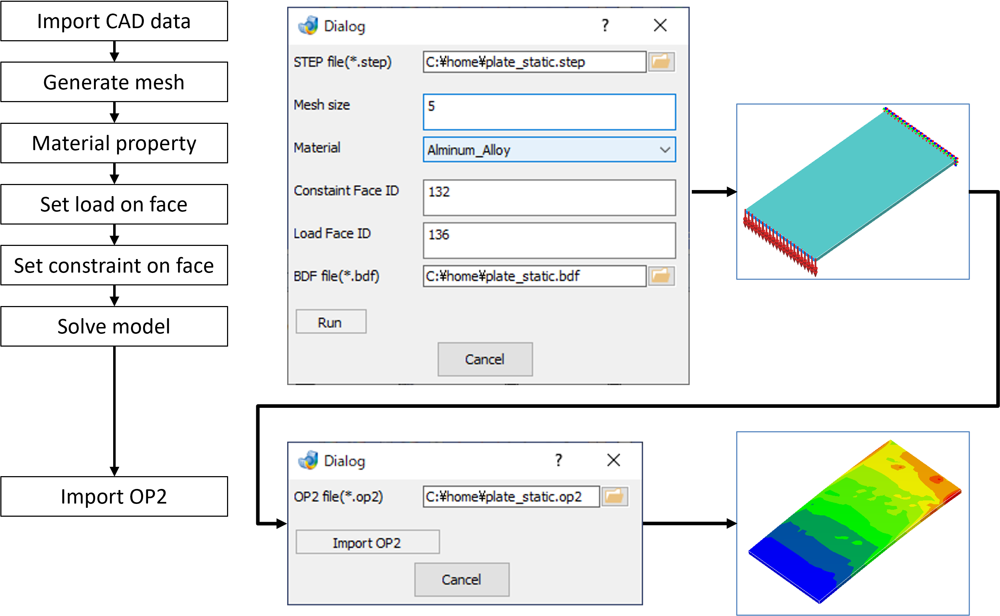
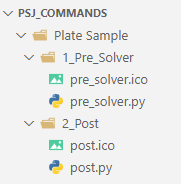
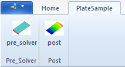

<Callout type="info" title="This sample contains topics as follows:">
- How to set menu on custom ribbon.
- How to define constraint.
- How to define load.
- How to run SunShine solver.
- How to import result op2 file.



</Callout>
## Sample data
- [Data for ribbon - Sample3.zip](./samples/PlateSample.zip)
- [Test model (.step)](./samples/plate_static.zip)

## How to use the Code

1. Copy all the content in Sample3.zip under "PSJ Commands folder" where %userprofile%\AppData\Roaming\TechnoStar\JPT _Version_\PSJ_Commands\ by default.
   Place the files so that the hierarchy is set as follows:  
   
2. Launch Jupiter. You will see "Plate Sample" ribbon.  
   
3. Click "pre_solver" icon on the ribbon. A dialog displayed.
4. Open attached step file at "STEP file".
5. Indicate arbitrary .bdf file name at "BDF file".
6. Click "Run" button. You will get .op2 file.
7. Create a new blank document.
8. Click "post" icon on the ribbon. Another dialog displayed.
9. Indicate .op2 file you get at "OP2 file".
10. Click "Import OP2" button. You will import the result in the document.

## Code for pre_solver icon

```psj

import sys
import os
import numpy  as np
import subprocess

from pyjdg import *

#--------------------------------------------------------------
def importCAD(dlg):
  name_file = dlg.get_item_text('File')     # get file name from filr browser
  imported_status = Home.ImportCAD.Spatial(strlPaths=[name_file],bSetFaceColor=True)
  JPT.Debugger(imported_status)

#--------------------------------------------------------------
def createMesh(dlg):
  global nid

  aname = ''
  msize = dlg.get_item_text('Mesh')
  aveSize = float(msize)/1000
  maxSize = aveSize*1.4
  minSize = aveSize*0.7

  listParts = JPT.GetEntitiesByName(JPT.DTableType.DTABLE_BODY, aname, JPT.BoolType.FALSE_VAL)
  npart = len(listParts)

  partname = listParts[0].name   # one(1) part in this sample model
  nid = listParts[0].id

  surface_status = Meshing.SurfaceMeshing(crlParts=[Part(nid)],
                   surfaceMesh=SURFACE_MESH(dAvgElemSize=aveSize,
                                            dMaxElemSize=maxSize,
                                            dMinElemSize=minSize))
  JPT.Debugger(surface_status)

  meshing_status = Meshing.SolidMeshing(crlParts=[Part(nid)],
                                                  bTet10=False)
  JPT.Debugger(meshing_status)


#------------------------------------------------
def materialList():
    global structure_steel, aluminum_alloy
    global nmat, matname

    #length:mm   weight:ton   force:N
    #Density:ton/mm3   YoungsModulus:N/mm2

    nmat = 2
    matname = ['']*nmat
    matname[0] = "Structural_Steel"
    matname[1] = "aluminum_alloy"

    structure_steel = Properties.Material.Add(matname[0],
                        [Density([(DENSITY, 7.85e-09)]),
                         Elastic([(YOUNGS_MODULUS, 200000.0),(POISSONS_RATIO, 0.3)])])

    aluminum_alloy = Properties.Material.Add(matname[1],
                        [Density([(DENSITY, 2.77e-09)]),
                         Elastic([(YOUNGS_MODULUS, 71000.0), (POISSONS_RATIO, 0.3)])])

#--------------------------------------------------------------
def defMaterial(dlg):
  matid = 0

  matprop = dlg.get_item_text('Material')
  for j in range(nmat):
    if matprop.replace(' ','') == matname[j]:     # ' Cushion ' => 'Cushion'
      matid = j

  created_prop =  Properties.Solid(strName="Solid Property1",
                               iPropertyId=1,
                               crMaterial=Material(matid+1),
                               iCordM=-2,
                               dDispHG=DFLT_DBL,
                               crlTargets=[Part(nid)],
                               iFLG=-1)

#--------------------------------------------------------------
def defConstraint(dlg):
  faceID = dlg.get_item_text('Constraint')   # id=132
  fid = int(faceID)
  creating_status = BoundaryConditions.FixedConstraint(crlTargets=[Face(fid)])
  JPT.Debugger(creating_status)


#--------------------------------------------------------------
def defLoad(dlg):
  loadID = dlg.get_item_text('Load')    # id=136
  lid = int(loadID)
  created_bcs = BoundaryConditions.Force.General(strName="Force1",
                                               forceLBC=FORCE_LBC(vecForce=[0.0,
                                                                            DFLT_DBL,
                                                                            -10.0]),
                                               crlTargets=[Face(lid)])
  JPT.Debugger(created_bcs)


#--------------------------------------------------------------
def exportFile(dlg):
  name_bdf = dlg.get_item_text('BDFFile')

  input_param = NASTRAN_ANALYSIS(iSolverType=6,
                               iGridFormatType=1,
                               dEpsilon=DFLT_DBL,
                               iMaxNumOfIter=DFLT_INT,
                               iNumberOfThreads=1,
                               iMemory=2,
                               iNcpu=1,
                               iSolNo=101,
                               nastranOutputRequest=NASTRAN_OUTPUT_REQUEST(iTypeStrain=0),
                               nastranNonlinear=NASTRAN_NONLINEAR(iMAXITER=DFLT_INT,
                                                                  bUseEPSW=True,
                                                                  dEPSU=DFLT_DBL,
                                                                  dEPSP=DFLT_DBL))
  export_status = Analysis.TSSS.LinearStatic(nastranAnalysis = input_param,
                                           strPath = name_bdf,
                                           iInitTempType=2)
  return name_bdf


#--------------------------------------------------------------
def staticAnal(name_bdf):
  program_path = JPT.GetProgramPath()
  sunshine = os.path.join(program_path, 'SunShine\\tss.bat')
  split_fold = name_bdf.split("\\")

  fold=split_fold[0]
  leng = len(split_fold)
  for i in range(leng-2):
      fold = fold + "\\" + split_fold[i+1]

  os.chdir(fold)
  print("Current directory = "+os.getcwd())
  process = subprocess.Popen([sunshine,name_bdf])

#--------------------------------------------------------------
def runButton(dlg):
  global name_bdf

  print('-- importing CAD ----')
  importCAD(dlg)

  print('-- meshing ----')
  createMesh(dlg)

  print('-- material definition ----')
  materialList()
  defMaterial(dlg)

  print('-- constraint definition ----')
  defConstraint(dlg)

  print('-- load definition ----')
  defLoad(dlg)

  print('-- running static ----')
  name_bdf = exportFile(dlg)    #計算用モデルファイルの書き出し
  staticAnal(name_bdf)

#--------------------------------------------------------------
def main():
    #dlg=JDGCreator(include_apply=False)
    dlg=JDGCreator(title="Dialog",resizable=True,validation=True, include_apply=False, include_ok=False)

    dlg.add_layout(name="レイアウト1",orientation=orientation.horizontal,layout="Window")
    dlg.add_label(name="ラベル1",width=100,height=30,text="STEP file(*.step)",layout="レイアウト1")
    dlg.add_browser(name="File",mode="file",
        file_filter="STEP file(*.step), All Files(*.*)",layout="レイアウト1")

    dlg.add_layout(name="レイアウト2",orientation=orientation.horizontal,layout="Window")
    dlg.add_label(name="ラベル2",text="Mesh size",width=100,height=30,text_halign="left",text_valign="top",layout="レイアウト2")
    dlg.add_textbox(name="Mesh",width=100,height=30,text="5",layout="レイアウト2")

    materialList()
    optcomb = []
    for i in range(nmat):
        optcomb.append(matname[i])

    dlg.add_layout(name="レイアウト3",orientation=orientation.horizontal,layout="Window")
    dlg.add_label(name="ラベル3",text="Material",width=100,height=30,text_halign="left",text_valign="top",layout="レイアウト3")
    dlg.add_combobox(name="Material",options=optcomb,index=1,layout="レイアウト3")

    dlg.add_layout(name="レイアウト4",orientation=orientation.horizontal,layout="Window")
    dlg.add_label(name="ラベル4",text="Constraint Face ID",width=100,height=30,text_halign="left",text_valign="top",layout="レイアウト4")
    dlg.add_textbox(name="Constraint",width=100,height=30,text="132",layout="レイアウト4")

    dlg.add_layout(name="レイアウト5",orientation=orientation.horizontal,layout="Window")
    dlg.add_label(name="ラベル5",text="Load Face ID",width=100,height=30,text_halign="left",text_valign="top",layout="レイアウト5")
    dlg.add_textbox(name="Load",width=100,height=30,text="136",layout="レイアウト5")

    dlg.add_layout(name="レイアウト6",orientation=orientation.horizontal,layout="Window")
    dlg.add_label(name="ラベル6",width=100,height=30,text="BDF file(*.bdf)",layout="レイアウト6")
    dlg.add_browser(name="BDFFile",mode="file",
        file_filter="BDF file(*.bdf), All Files(*.*)",layout="レイアウト6")

    dlg.add_layout(name="レイアウト7",orientation=orientation.horizontal,layout="Window")
    dlg.add_button(name="ボタン7",text="Run",width=60,height=22,layout="レイアウト7")

    dlg.on_command("ボタン7",runButton)

    dlg.generate_window()

#--------------------------------------------------------------
if __name__=='__main__':
    main()
```

## Code for post icon

```psj

import sys
import os
import numpy  as np
import subprocess

from pyjdg import *

#--------------------------------------------------------------
def importResult(dlg):

  name_op2 = dlg.get_item_text('OP2File')

  JPT.Exec(
     f"CmdImportTSVOp2Post({name_op2}, 1, 1.0472, 1.0472, 0, 0, 0)"
  )

  '''
  available_result_option = \
    JPT.GetAvailableResultOption(JPT.PostAnalysisType.POST_ANALYSIS_LINEAR_STATIC,
                                 1,
                                 1,
                                 "Displacement",
                                 "X",
                                 JPT.PostResultDataLoc.POST_LOC_ON_NODE,
                                 JPT.GetDefaultResultOption(JPT.PostAnalysisType.POST_ANALYSIS_LINEAR_STATIC,
                                                            1,
                                                            1,
                                                            "Displacement",
                                                            "X",
                                                            JPT.PostResultDataLoc.POST_LOC_ON_NODE))
  '''
  #CmdImportTSVOp2Post("C:/home/Job_2.op2", 1, 1.0472, 1.0472, 0, 0, 0)


def importOP2(dlg):
  print('-- importing result ----')
  importResult(dlg)


#--------------------------------------------------------------
def main():
    #dlg=JDGCreator(include_apply=False)
    dlg=JDGCreator(title="Dialog",resizable=True,validation=True, include_apply=False, include_ok=False)

    dlg.add_layout(name="レイアウト6",orientation=orientation.horizontal,layout="Window")
    dlg.add_label(name="ラベル6",width=100,height=30,text="OP2 file(*.op2)",layout="レイアウト6")
    dlg.add_browser(name="OP2File",mode="file",
        file_filter="OP2 file(*.op2), All Files(*.*)",layout="レイアウト6")

    dlg.add_layout(name="レイアウト7",orientation=orientation.horizontal,layout="Window")
    dlg.add_button(name="ボタン62",text="Import OP2",width=120,height=22,layout="レイアウト7")

    dlg.on_command("ボタン62",importOP2)

    dlg.generate_window()

#--------------------------------------------------------------
if __name__=='__main__':
    main()
```
