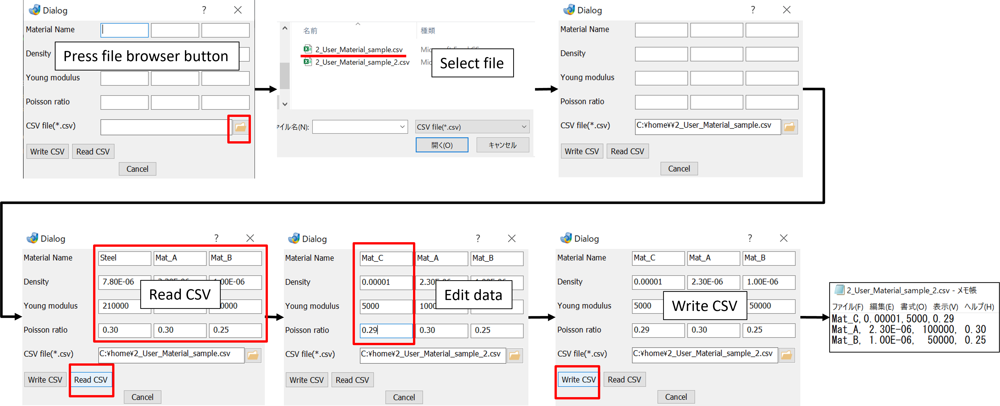

<Callout type="info" title="This sample contains topics as follows:">
- How to read csv file into textBox
- How to use file browser (GUI)



</Callout>
## How to use the Code 
1. Run the attached code.
2. Open csv file via dialog.
3. Click "Read CSV" button to read content into the table of the dialog.
4. Click "Write CSV" button to save (overwrite) content to csv file.

## Content of CSV File for this sample

```py
Steel, 7.80E-06, 210000, 0.30
Mat_A, 2.30E-06, 100000, 0.30
Mat_B, 1.00E-06,  50000, 0.25
```

## Code

```py

from pyjdg import *

#--------------------------------------------------------------
def readCSV(dlg):
  file = dlg.get_item_text('File')     # get file name from file browser
  fi = open(file, "r")

  for i in range(3):
    line = fi.readline().replace('\n','')
    cha = line.split(',')
    bname    = 'TextBox1'+str(i+1)    # when i=0, bname='TextBox11'
    bdensity = 'TextBox2'+str(i+1)
    byoung   = 'TextBox3'+str(i+1)
    bpoisson = 'TextBox4'+str(i+1)
    dlg.set_item_text(name=bname   ,text=cha[0])
    dlg.set_item_text(name=bdensity,text=cha[1])
    dlg.set_item_text(name=byoung  ,text=cha[2])
    dlg.set_item_text(name=bpoisson,text=cha[3])

  fi.close()

#--------------------------------------------------------------
def writeCSV(dlg):
  file = dlg.get_item_text('File')
  fo = open(file, "w")

  for i in range(3):
    bname    = 'TextBox1'+str(i+1)
    bdensity = 'TextBox2'+str(i+1)
    byoung   = 'TextBox3'+str(i+1)
    bpoisson = 'TextBox4'+str(i+1)
    name    = dlg.get_item_text(name=bname   )
    density = dlg.get_item_text(name=bdensity)
    young   = dlg.get_item_text(name=byoung  )
    poisson = dlg.get_item_text(name=bpoisson)
    line = name + ',' + density + ',' + young + ',' + poisson + '\n'
    fo.write(line)

  fo.close()

#--------------------------------------------------------------
def readButton(dlg):
  print('-- reading csv ----')
  readCSV(dlg)

#--------------------------------------------------------------
def writeButton(dlg):
  print('-- writing csv ----')
  writeCSV(dlg)

#--------------------------------------------------------------
def main():
    #dlg=JDGCreator(include_apply=False)
    dlg=JDGCreator(title="Dialog",resizable=True,validation=True, include_apply=False, include_ok=False)

    dlg.add_layout(name="レイアウト1",orientation=orientation.horizontal,layout="Window")
    dlg.add_label(name="ラベル1",text="Material Name",width=100,height=30,text_halign="left",text_valign="top",layout="レイアウト1")
    dlg.add_textbox(name="TextBox11",width=100,height=30,layout="レイアウト1")
    dlg.add_textbox(name="TextBox12",width=100,height=30,layout="レイアウト1")
    dlg.add_textbox(name="TextBox13",width=100,height=30,layout="レイアウト1")

    dlg.add_layout(name="レイアウト2",orientation=orientation.horizontal,layout="Window")
    dlg.add_label(name="ラベル2",text="Density",width=100,height=30,text_halign="left",text_valign="top",layout="レイアウト2")
    dlg.add_textbox(name="TextBox21",width=100,height=30,layout="レイアウト2")
    dlg.add_textbox(name="TextBox22",width=100,height=30,layout="レイアウト2")
    dlg.add_textbox(name="TextBox23",width=100,height=30,layout="レイアウト2")

    dlg.add_layout(name="レイアウト3",orientation=orientation.horizontal,layout="Window")
    dlg.add_label(name="ラベル3",text="Young modulus",width=100,height=30,text_halign="left",text_valign="top",layout="レイアウト3")
    dlg.add_textbox(name="TextBox31",width=100,height=30,layout="レイアウト3")
    dlg.add_textbox(name="TextBox32",width=100,height=30,layout="レイアウト3")
    dlg.add_textbox(name="TextBox33",width=100,height=30,layout="レイアウト3")

    dlg.add_layout(name="レイアウト4",orientation=orientation.horizontal,layout="Window")
    dlg.add_label(name="ラベル4",text="Poisson ratio",width=100,height=30,text_halign="left",text_valign="top",layout="レイアウト4")
    dlg.add_textbox(name="TextBox41",width=100,height=30,layout="レイアウト4")
    dlg.add_textbox(name="TextBox42",width=100,height=30,layout="レイアウト4")
    dlg.add_textbox(name="TextBox43",width=100,height=30,layout="レイアウト4")

    dlg.add_layout(name="レイアウト5",orientation=orientation.horizontal,layout="Window")
    dlg.add_label(name="Label5",width=100,height=30,text="CSV file(*.csv)",layout="レイアウト5")
    dlg.add_browser(name="File",mode="file",
        file_filter="CSV file(*.csv), All Files(*.*)",layout="レイアウト5")

    dlg.add_layout(name="レイアウト6",orientation=orientation.horizontal,layout="Window")
    dlg.add_button(name="ボタン61",text="Write CSV",width=60,height=22,layout="レイアウト6")
    dlg.add_button(name="ボタン62",text="Read CSV",width=60,height=22,layout="レイアウト6")

    dlg.on_command("ボタン61",writeButton)
    dlg.on_command("ボタン62",readButton)

    dlg.generate_window()

#--------------------------------------------------------------
if __name__=='__main__':
    main()
```
